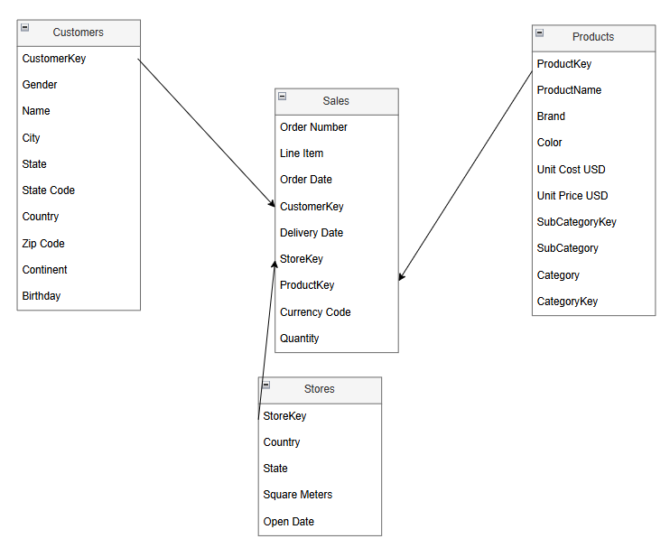

# Global-Electronics-Retail-Sales-2016-2021

## Table of Contents

- [Background and Overview](#background-and-overview)
  
- [Data Structure and Overview](#data-structure-and-overview)
  
- [Executive Summary](#executive-summary)
  
- [Insights Deep Dive](#insights-deep-dive)
  
- [Recommendations](#recommendations)

- [Assumptions and Caveats](#assumptions-and-caveats)
  
- [Next Steps](#next-steps)

## Background and Overview

**Nexora Electronics** is a fictitious global electronics retailer with operations spanning North America, Europe, and Australia. The company offers a diverse range of consumer electronics spread across 8 categories- Computers, Cell phones, TV and Video, Home Appliances, Music Movies and Audio Books, Audio, Cameras and camcorders, Games and Toys. Nexora’s omnichannel strategy allows it to sell products both through its e-commerce platforms and physical retail stores which are present in 8 countries- United States, United Kingdom, Germany, Australia, Canada, France, Italy and Netherlands.

This project is based on six years of transaction-level data (2016–2021) spanning multiple interconnected datasets. For the purpose of this analysis, a four-year period (2016–2019) is used, covering:

•	Sales and order transactions

•	Customer demographics

•	Product information

•	Store locations

**The primary objective is to analyse sales performance across regions and categories to help sales teams device stratergies to harness areas of revenue growth.**

Link to dashboard: https://github.com/rutujads-1/Global-Electronics-Retail-Sales-2016-2021/blob/main/Global%20electronics%20Dashboard.pbix

## Data Structure and Overview

  

 

**Sales** - Fact table containing transaction-level records. Each row represents a specific order line, including order and delivery dates, quantity, unit price, and related foreign keys for customer, product, store, and currency.

**Products** - Dimension table listing product details, including product name, brand, category, sub-category, description, pricing, and lifecycle dates.

**Customers** - Dimension table with customer demographic information such as customer ID, name, birthdate, gender, and country.

**Stores** - Dimension table containing store-level attributes including store name, location (city, country), and a unique store identifier.

## Executive Summary

  
  

 

  

 

The business generated a total revenue of $45M through 21K orders with a profit of ~ $27M across the four year period.

**Revenue and order volume showed a parallel upward trend till 2019. Over the years a quarterly trend emerged, where revenue and order volume showed a decline from Q1 to Q2 and then an increase from Q3 to Q4. This pattern can be explained by the end of year festive surges.** 

The **major drivers** of the seasonality trend were- **Computers, Cameras and camcorders, Cell phones and TV and Video**. 

Overall, Computers category was the major contributor in revenue and order volume. Games and Toys category was the least contributor to revenue while TV and Video category drove the least orders. Profit margins were comparable across product categories which indicates performance is driven by revenue, order volume or Average Order Value(AOV). 

Regionally, the **United States** contributed to nearly half of the total revenue while countries like France earned the lowest revenue but the AOV was comparable across the countries which indicates that differences in order volume led to the differences in performance. 

Since the United States drove a revenue of ~19M which is almost half of the total revenue, **the focus is on this market to identify levers of growth and areas of improvement.**

## Insights Deep Dive

### Product Performance In United States

Among the 8 product categories, different categories added different value in terms of the metrics- revenue and order volume. **Top 3 products** in terms of **revenue** were- **Computers, Home Appliances and Cameras and camcorders**.

In terms of **order volume** the  top 3 products were- **Computers, Cell phones and Music Movies and Audio Books**. 

  

**Top Revenue generating products-**

**1. Computers**

  

  Revenue split for Computers by subcategories.

 

Similar to the overall product trend, **computers are the most important category** in the United States driving a  total revenue of **$ 6M**  with **~4K orders**.
Within computers the **desktop sub category drove revenue** generating a total of $3M which is half of the total revenue the category generates while the accessory parts like printers, scanners and Fax generated the least revenue of $255K. Since this is a high performing category driven by desktops, during the peaks in Q4 high selling SKUs can be meaningfully bundled with accessory parts to increase basket value. 

**2. Home Appliances**

  

  Revenue split for Home Appliances by subcategories.

 

Home Appliances is the second highest revenue generating category(**$4M**) with the highest AOV, which explains that this is a high priced category where users don’t buy frequently but spend heavy amounts per order. This category is driven by **Water heaters** in terms of revenue while coffee machines and microwaves contribute less. To maximise revenue from this category,strategies to increase sales basket value can be devised during the high demand periods. 

**3. Cameras and camcorders**
   

  

  Revenue split for Cameras and camcorders by subcategories.

 

Cameras and camcorders is the third highest revenue generating category(**$2M**) with a mid range AOV, demonstrating that again this is a high priced niche category which has less total orders but has high per order purchase. This category is driven by **Camcorders** which generate the highest revenue while digital cameras contribute the least. Both sub categories have comparable units sold but Camcorders have a high AOV in comparison to digital cameras. The difference in performance is due to price points and not a lot due to demand. 

**Top Order Volume generating products-**

**1. Computers**
   

  

  Order Volume split for Computers by subcategories.

 

Computers is not only the highest revenue generating but highest selling category in terms of order volume with a total of **3,720** orders with **desktops** being the **highest selling sub category**. 

**2. Cell phones**
   

  

  Order Volume split for Cell phones by subcategories.

 

Cell phones are the second highest contributor to order volume(**2,715 orders**) after computers and drive a good share of revenue. Revenue from this category does depend on order volume since per purchase amount spent is less. This category is led by **Touch Screen Phones and Smart phones** & PDAs which generate comparable revenue. 

**3. Music Movies and Audio Books**
   

  

  Order Volume split for Music Movies and Audio Books by subcategory.

 

Music Movies and Audio Books is the third highest contributor to order volume(**2,609 orders**) but generates low revenue indicating that this is again a volume driven category with low price points. This has **only one subcategory of Movie DVDs** with two brands offering products. Since this category does have demand indicated by the order volume, a new brand and product variations can be introduced with different pricing and the performance can then be monitored. 

### Performance across stores in the United States

  

There are a total of **20 stores** in the United States spread across different regions. The top 3 stores in terms of revenue are StoreKey 50,54,55.

Analysing further to see if store performance impacts revenue across categories shows that **store performance does have an impact in sales across categories**.

  

  The table contents here are filtered and represented for one category to show the slack, a period where no sale happened in the month represented as blank, which is observed across all categories.

  

Monthly analysis across revenue, order volume, month-on-month growth, and AOV reveals that some stores experience recurring **slack months with zero sales**, while others continue to generate revenue during the same periods. This pattern is observed across all categories. Encouragingly, the frequency of such slack months has declined over time, which could indicate improved store–category coverage and greater demand consistency compared to earlier years.

Apart from the year end Q4 spike, there are **seasonal spikes across the months of April to June** with spikes in revenue being **prominent in May** across majority stores for all product categories through all  years till 2019. These spikes could indicate increased demand in the summer months while overall sales in Q1 and Q2 are slow. 

Another pattern found across some outlets is that certain stores **are not showing month on month revenue growth** in  **Q4** which is **alarming** because Q4 is the main heavy demand season. This pattern is again seen across categories and could have an impact specifically in case of high revenue generating categories like computers. 

### Customer Profile Analysis

  
  

In the United States there are ~ **7K customers** generating a revenue of $19M. Across age groups, the numbers are comparable except for the **disparity in 18-24** where customer count is extremely low in comparison to other age brackets. 

This is directly related to the revenue generated through each category, as **other categories have a higher revenue generation** in comparison to 18-24. 

With the estimated United States population in 2019 being approximately 328 million, this market has huge potential and we need strategies to increase the customer base. 

  

On analysing repeat purchase behavior, while repeat purchasing has increased steadily over time, the low absolute values indicate that **customer retention remains weak** overall and we need stratergies to increase retention which have the potential to improve revenue outcomes. 

Across all these age groups three product categories have shown a constant increase in the revenue year on year - **Audio, Cell phones and Computers**. Efforts should be put into devising strategies to maximise outputs from here since they cater to all age groups. 

## Recommendations

1. Analyse underperforming stores in Q4 and replicate best practices from high-growth locations to maximise performance during peak demand.

2. Introduce loyalty and rewards programs to improve customer retention, increase repeat purchases, and reduce recurring monthly revenue slumps, while enabling more personalised, data-driven customer engagement.

3. Strategic partnerships with third-party distributors could broaden distribution channels and support customer base expansion in the U.S., which currently stands at approximately 7K customers.

4. Strategy development for the Audio, Computers, and Cell Phones categories is likely to be more straightforward, given their consistent year-over-year revenue growth across age groups.
   

## Assumptions and Caveats

### Assumptions

1. All sales are assumed to be at full unit price.
   
Since no discount, promotional, or negotiated prices are provided, revenue is calculated as:

Revenue = Quantity × Unit Price

2. Product cost and unit price are fixed over time.
   
There's no time-based fluctuation captured in product pricing.

3.  StoreKey 46,52,58 and 60 have shown no sales in this four year period and thus have not been taken into consideration.

### Caveats

1. Revenue is estimated using full Unit Prices without considering discounts, returns, or promotional pricing.

2. The analysis does not factor in currency exchange rate volatility over time — all revenue figures are calculated in USD using the provided static rates.
 

## Next Steps

1. Price Elasticity Analysis:
   
Extend the analysis by introducing simulated price increases and decreases to evaluate demand sensitivity, as current cost data is static.

3. Market Basket Analysis:
   
Analyse co-purchasing patterns to identify products that are frequently bought together and assess potential bundling opportunities.

